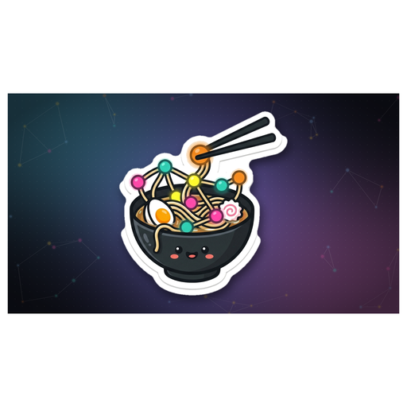
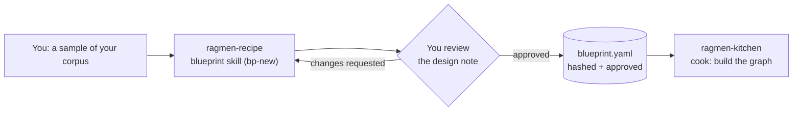

<div align="center">


# RAGmen Recipe

**Noodles are nodes. Instant GraphRAG without the long cooking.**

Design-time skill for planning a schema-grounded GraphRAG system. Inspects corpus samples, proposes the workload, ontology, embeddings, guardrails, and community plan, then emits an approved `blueprint.yaml`.

[](https://neo4j.com)
[](https://modelcontextprotocol.io)
[](LICENSE)

 Sister repo: [ragmen-kitchen](https://github.com/Kamaal404/ragmen-kitchen-) cooks the blueprints that Recipe designs.

</div>

## Why

Plain RAG returns chunks. GraphRAG returns relationships. But schema design is the slow, painful part that most projects get wrong: you pick types and relations by intuition, build the graph, and discover weeks later that the ontology does not answer real questions. RAGmen splits the work. Recipe reads a sample of your corpus, proposes an ontology with justification, and makes you approve it before any extraction spend. Kitchen then executes that approved blueprint deterministically. No ontology drift, no guessing, no expensive mistakes hidden until query time.

## The menu

| Kitchen term | What it does | Status |
|---|---|---|
| **recipe** | Design and sign off a blueprint from a corpus sample | 🟢 working |
| **toss** | Validate blueprint schema, hash, and approval | 🟢 working |
| **cook** | Chunk, extract, embed, load into Neo4j | 🟢 working (in ragmen-kitchen) |
| **simmer** | Entity resolution, incremental updates, drift reporting | ⚪ planned |
| **taste** | Golden-set evaluation with recall@k in CI | ⚪ planned |
| **serve** | Read-only MCP server with hybrid retrieval and citations | ⚪ planned |

## How it fits together



The skill never ingests the full corpus or writes to a database. It stops at an approved blueprint so you can check the design before any money is spent on extraction.

## Quickstart

```bash
# Install dependencies
pip install -r requirements.txt

# Inspect a corpus before designing anything
python blueprint/scripts/inspect_corpus.py --input ./corpus.pdf --show-sample

# Design the blueprint (use the Claude Code skill, or write by hand)

# Validate and hash
python blueprint/scripts/validate_blueprint.py blueprints/mine.yaml --hash

# Run the test suite (no LLM, no database, no network)
python -m pytest -q
```

## Contract

The blueprint hash is `sha256` over canonical UTF-8 JSON with sorted keys and no whitespace, after removing `blueprint_hash` and `approval`. Approval is added by the user, or by an explicit approval command after confirmation.

Everything stands on one artifact: `spec/blueprint.schema.json`. Forge and Serve consume a validated blueprint and make **no ontology decisions**. If either would have to decide what something means, the blueprint is incomplete.

Five sections:

1. **structure** -- how raw sources become chunks, deterministically
2. **ontology** -- closed type system with exhaustive domain/range patterns
3. **embedding** -- what gets vectorised and how
4. **workload** -- the questions the graph must answer, which is what makes the ontology falsifiable
5. **guardrails** -- what must never leak, compiled into Cypher rather than prompts

Sections 4 and 5 are the ones usually missing, and they are the difference between a demo and something another person can trust.

## Using your own content

This repository ships no corpus. Point the skill at documents you own or are allowed to process, and keep the source files out of Git.

The runtime is maintained separately at `Kamaal404/ragmen-kitchen-`. The only contract between the two repositories is the versioned blueprint schema and the validated blueprint artifact.

The Fire Graph material is an integration-test fixture, not a product.

## Tests

```bash
python -m pytest -q
```

The test suite validates that the schema, validator, and corpus inspector all reject bad input correctly. All tests run offline with no API key or database.

## License

MIT.