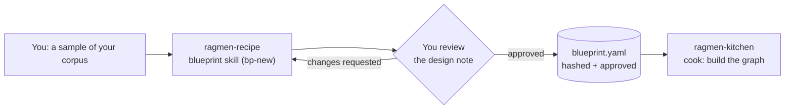

# ragmen-recipe

Design-time skill for planning a schema-grounded GraphRAG system.

It inspects corpus samples, proposes the workload, ontology, embeddings,
guardrails, and community plan, then emits an approved `blueprint.yaml`. It
does not build Neo4j data or run full-corpus ingestion.

## How it fits together



The skill never ingests the full corpus or writes to a database. It stops at
an approved blueprint so you can check the design before any money is spent on
extraction.

## Using your own content

This repository ships no corpus. Point the skill at documents you own or are
allowed to process, and keep the source files out of Git.

The runtime is maintained separately at `Kamaal404/ragmen-kitchen-`. The only
contract between the repositories is the versioned blueprint schema and the
validated blueprint artifact.

The Fire Graph material is an integration-test fixture, not a product.

## Contract

The blueprint hash is `sha256` over canonical UTF-8 JSON with sorted keys and
no whitespace, after removing `blueprint_hash` and `approval`. Approval is
added by the user, or by an explicit approval command after confirmation.

Run the offline tests with:

```powershell
python -m pytest -q
```
